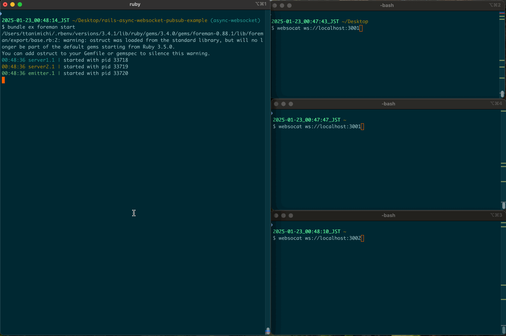

# rails-async-websocket-pubsub-example

## Development

```
$ bundle ex foreman start
$ websocat ws://localhost:3001
$ websocat ws://localhost:3002
```



## Production

```
$ bundle exec falcon host
```
